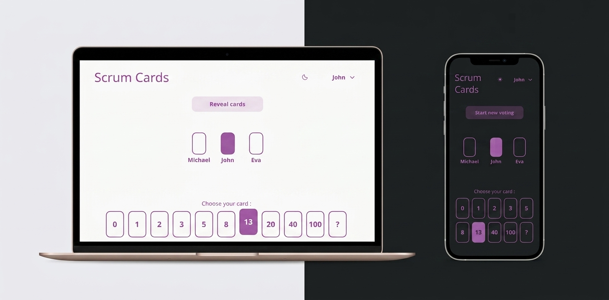

# Scrum Cards

A planning poker app I've been building as a side project — my excuse for
experimenting with new technologies and learning by shipping something small but
complete. It's built as a tool for smaller and bigger teams living in a scrum or
agile environment, and meant to be self-hosted.

Planning poker is how a team estimates work together: everyone secretly picks a
score, then the scores are revealed at once. If the estimates are close, the card
is done; if they're spread out, the team talks and tries again. Scrum Cards runs
exactly that loop in the browser.

## How it's put together

The project is two halves:

- **[Backend](https://github.com/sqqid/scrum-cards-backend)** — Go, standard
  library only. Rooms live in memory, and every change is pushed to the whole
  room over server-sent events. No web framework, no database, no third-party
  runtime dependencies.
- **[Frontend](https://github.com/sqqid/scrum-cards-ui)** — React and
  TypeScript, bundled with Vite. RxJS drives the live parts, and the styling is
  plain BEM CSS with light/dark theming.

Each half lives in its own repository, pulled in here as submodules so the
whole app can be built from a single checkout.

In production they collapse into a single Docker image: nginx serves the
frontend and proxies the API to the Go backend, with proxy buffering switched off
so the event streams can flow. One container, one port, nothing else to run.
